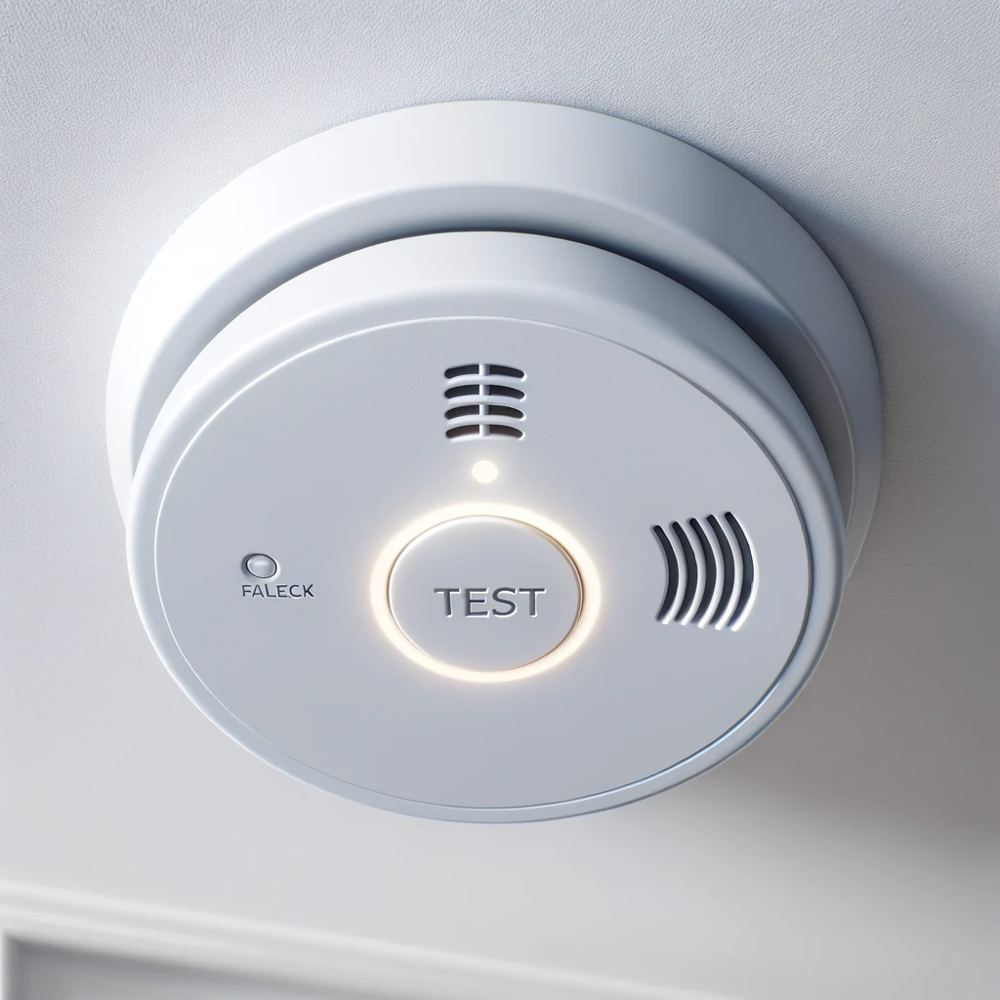
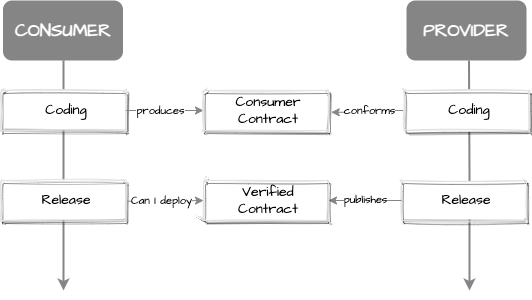

# Short and sweet

## Pact: Consumer Driven Contracts

---

#### Do you set your house on fire to test your smoke alarm?
#### [pact.io](https://docs.pact.io/)

---

## What is pact?

* Contract Testing
    - An alternative paradigm to Integration testing
* Consumer first
    - An alternative to Code First and Contract First API development
* Can I deploy?
    - Sync rollouts
    - Verify breaking changes before deployments

---

# Demo: Consumer First API Example

[Consumer first API example](https://github.com/enisspahi/consumer-first-api-example)

---

# Demo: Message Driven Pact Example
[Pact Messaging example](https://github.com/enisspahi/pact-messaging)

---

# When to use Pact?

- Provider matches consumer needs during API development
- API consumer and provider test their applications independently
- To reduce the overhead while syncing API and consumer rollout
- On small number of consumers

---

# References

- [pact.io](https://pact.io/)
- [Communicating our APIs: Three methodologies of API Development](https://openvalue.blog/posts/2023/11/26/communicating_our_apis_part2/)

---

# Q&A